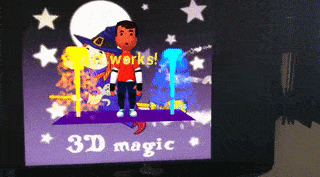

# MARTINS.js WebAR engine

   

Create amazing Augmented Reality experiences with **MARTINS.js**, a GPU-accelerated Augmented Reality engine for the web. Users don't need specialized hardware nor dedicated software - only a modern and compatible web browser.

MARTINS.js is developed independently by [Alexandre Martins](https://github.com/alemart) and is [dual-licensed](https://alemart.github.io/martins-js/faq#what-about-the-licensing). It's based on [Speedy Vision](https://github.com/alemart/speedy-vision).

## Features

Currently supported features:

* **Image tracking**, also known as natural feature tracking. Use it to track detailed images such as: book covers, cartoons and photos.

 

## Documentation

Full documentation is available at <https://alemart.github.io/martins-js/>.

Cool demos are available at <https://alemart.github.io/martins-js/demos/>.

## Why use MARTINS.js?

Here is why MARTINS.js is a great choice for creating Augmented Reality experiences:

* **No need to download apps!** MARTINS.js is a WebAR engine. It runs in web browsers. Users can access the AR experience immediately.
* **Fast and powerful!** MARTINS.js is GPU-accelerated. It uses WebGL2 and WebAssembly for turbocharged performance.
* **No need of custom hardware or software!** MARTINS.js is built from scratch using standard web technologies. All it requires is a modern and compatible web browser.
* **Fully standalone!** MARTINS.js has in it everything it needs to analyze the environment and help you create AR. There are no additional requirements. It's not WebXR.
* **Easy to get started!** MARTINS.js can be used with a `<script>` tag in your page. A static HTML page is enough to get started.

## Try WebAR right now!

1. Scan or tap the QR code below with a mobile device.
2. A web page will be opened. It's the WebAR experience.
3. The web page will request access to your webcam. Authorize it.
4. Scan the cartoon below.
5. Enjoy! :wink:

>
> **Guidelines for WebAR:**
>
> - WebGL2 and WebAssembly are required. Use a [compatible browser](#browser-compatibility).
> - Don't move the camera too quickly - it produces motion blur.
> - The physical environment should be properly illuminated.
> - Avoid low-quality cameras (cameras of common smartphones are OK).
>

## Browser compatibility

MARTINS.js is compatible with the latest versions of almost all major web browsers:

| Chrome | Edge | Firefox | Opera | Safari |
| ------ | ---- | ------- | ----- | ------ |
| ✔      | ✔    | ✔       | ✔     | -      |

At the time of this writing, Safari is not yet compatible. MARTINS.js requires WebGL2 and WebAssembly.

## Contact

[Get in touch!](https://alemart.github.io/martins-js/contact)