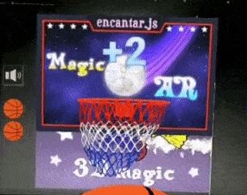
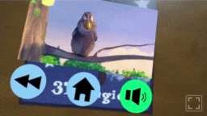

# encantar.js webAR engine :magic_wand:

   

encantar.js is a GPU-accelerated Augmented Reality framework for the web.

* It's **compatible with all platforms**: iOS, Android, Desktops...
* It can run in devices without native support for AR / WebXR
* It's **blazing fast**, built with GPU acceleration at its core
* It's **easy to use** for developers and artists alike
* It's **open source**: no vendor lock-in and no usage limits
* **All you need is a modern web browser** - no app required!

Get started at <https://encantar.dev> :magic_wand:

## Help make open source webAR possible

I develop open source webAR independently. Support my work to help me continue it.

## Demos

Select any picture below, or [browse the website](https://encantar.dev/demos) for more!

  

## Documentation

Learn the incantations:

* [Tutorial for aspiring wizards](https://encantar.dev/tutorial)
* [API Spellbook](https://encantar.dev/api)
* [FAQ](https://encantar.dev/faq)

## Core features

Core incantations:

* **Image tracking**: track detailed images such as cartoons or photos. Import your [custom images](https://encantar.dev/guidelines-for-images) and it just works!
* **Pointer tracking**: create interactive experiences based on touch and mouse input with an easy-to-use API.
* **Plugins**: use encantar.js with the 3D engine of your choice: [A-Frame](https://encantar.dev/api/plugin-aframe/), [babylon.js](https://encantar.dev/api/plugin-babylon/), [three.js](https://encantar.dev/api/plugin-three/), or any other!

## Add-Ons

[Extra incantations](https://encantar.dev/addons):

* **Video Player**: easy-to-use video player with controls - suitable for promotional materials, educational content, interactive art, and much more.
* **Buttons & Clickables**: easily trigger reactions when buttons or 3D objects are tapped in AR.
* **Take Photos**: make your webAR experiences memorable! Turn them into a camera app.

## About

encantar.js is developed by [Alexandre Martins](https://github.com/alemart) and released under the [GNU LGPL v3](LICENSE.md). It's based on [speedy-vision](https://github.com/alemart/speedy-vision), a computer vision library for JavaScript created by the same author.
