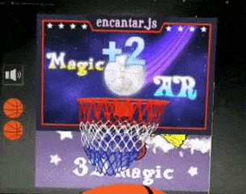
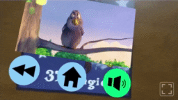

# encantar.js: GPU-accelerated Augmented Reality library for the web

✅ High performance WebAR — ✅ Easy to use & deploy — ✅ Works anywhere (iOS, Android, Desktops)  

🪄 [Download the library](https://encantar.dev/download) | 💫 [Try the demos](https://encantar.dev/demos) | 📚 [Follow the tutorial](https://encantar.dev/tutorial)

  

-----

## Features

* **Broad compatibility** - Create WebAR experiences for all platforms: iOS, Android, Desktops. WebXR support isn't required thanks to encantar's custom trackers based on Computer Vision.
* **High performance** - Deliver blazing fast AR experiences to a wide user base through encantar's GPU-accelerated trackers and WebAssembly-powered computational wizardry.
* **Easy to use** - Use encantar's user-friendly API with the 3D engine of your choice: [A-Frame](https://encantar.dev/api/plugin-aframe), [babylon.js](https://encantar.dev/api/plugin-babylon), [three.js](https://encantar.dev/api/plugin-three), or any other! A static HTML page that you can host anywhere is all you need for WebAR!
* **Frictionless for users** - With encantar.js, users don't need to download apps. They can simply open your web page, typically by scanning a QR code, and easily experience Augmented Reality in the browser.
* **Image tracking** - Track [custom images](https://encantar.dev/guidelines-for-images) such as cartoons or photos with ease — there is no need for manual training steps or custom setups. This is also known as Natural Feature Tracking.
* **Pointer tracking** - Create interactive experiences based on touch and mouse input with a convenient and user-friendly API.
* **Addons** - Enchant your users with [additional features](https://encantar.dev/addons) that enhance the core of encantar.js!

## Documentation

* [Get started with encantar.js](https://encantar.dev/tutorial)
* [Guidelines for Images](https://encantar.dev/guidelines-for-images)
* [API Spellbook](https://encantar.dev/api)
* [FAQ](https://encantar.dev/faq)

## About

encantar.js is developed by [Alexandre Martins](https://github.com/alemart) and released under version 3 of the [GNU GPL](LICENSE.md), with optional terms enabling usage in proprietary software. It's based on [speedy-vision](https://github.com/alemart/speedy-vision), a GPU-accelerated Computer Vision library for JavaScript created by the same author.

Contact: <support@encantar.dev> 🧙‍♂️