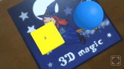

# AR Clickable

An A-Frame component that turns 3D and 2D objects into "clickables" that respond to pointer input. Registered entities will receive certain [events](#events). You can add interactivity to them by employing easy-to-use [declarative event handlers](#declarative-handlers) such as `ar-onclick`, or by [writing your own event handlers in JavaScript](#advanced-usage).

!!! tip "Important"

    AR Clickables **require** an [ar-pointer-tracker](../api/plugin-aframe.md#ar-pointer-tracker) in your scene!

{ .responsive }

## Properties

| Property | Description | Default |
| -------- | ----------- | ------- |
| `enabled` | Whether or not the entity will receive certain [events](#events). | `true` |

## Declarative handlers

### Overview

Declarative event handlers are components used to register event listeners that set properties. They provide an easy way to create interactivity within your HTML page. There is a component for each [event](#event):

| Handler | Description |
| ------- | ----------- |
| `ar-onclick` | Triggered when the entity receives a `"click"` event. |
| `ar-onmousedown` | Triggered when the entity receives a `"mousedown"` event. |
| `ar-onmouseup` | Triggered when the entity receives a `"mouseup"` event. |

*Example*

```html
<!-- Turn a yellow box into red when clicked -->
<a-box color="yellow" ar-onclick="material.color: red"></a-box>
```

!!! question "Where is ar-clickable?"

    Whenever using a declarative handler, `ar-clickable` is implied. There is no need to set it explicitly.

### Special properties

The following special properties are used to further customize the declarative handlers:

| Property | Description |
| -------- | ----------- |
| `_target` | Query selector to be used when setting properties on a different entity. |
| `_delay` | Delay, in milliseconds, before setting the properties. |

!!! question "What about event-set?"

    Declarative handlers are similar to A-Frame's event-set in their usage, but there are differences behind the scenes. Whenever working with AR Clickables, usage of the declarative handlers presented in this page is recommended.

### Multiple handlers

Use double-underscores (`__`) to attach multiple handlers of the same type to a single entity:

*Example*

```html
<!-- Turn a yellow box into red when clicked,
     and then turn it back to yellow after a second -->
<a-box color="yellow"
    ar-onclick__1="material.color: red"
    ar-onclick__2="_delay: 1000; material.color: yellow"
></a-box>
```

## Events

Entities with an attached `ar-clickable` receive events analogous to mouse events of the 2D web:

| Event name | Description |
| ---------- | ----------- |
| `"click"` | The entity was clicked. |
| `"mousedown"` | Fired whenever a pointing device button is pressed while the pointer is intersecting the entity. |
| `"mouseup"` | Triggered whenever a pointing device button is released after `"mousedown"` is fired. |

Event details:

| Detail | Description |
| ------ | ----------- |
| `intersection` | three.js intersection object, or `null` if that is unavailable. |
| `pointer` | The [TrackablePointer](../api/trackable-pointer.md) associated with the event. |

## Advanced usage

You can also write your own event handlers in JavaScript as in the template below:

```js
/*
  Usage:
  <a-box alert-on-click></a-box>
*/
AFRAME.registerComponent('alert-on-click', {

    dependencies: [ 'ar-clickable' ],

    init()
    {
        this._onclick = this._onclick.bind(this);
    },

    play()
    {
        this.el.addEventListener('click', this._onclick);
    },

    pause()
    {
        this.el.removeEventListener('click', this._onclick);
    },

    _onclick(event)
    {
        alert('You clicked me!');
        console.log(event.detail);
    },

});
```