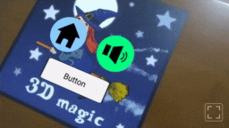
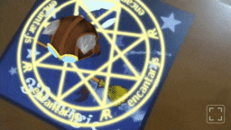

# Add-Ons

Add-Ons provide an enriched experience with additional features that enhance the core of encantar.js. They are provided as extra perks for supporters. Take a look at these enchanting features! &#x1F60D;

<link rel="stylesheet" href="../style/lite-yt-embed.css">

<section id="addons" markdown>

  

## Video Player

Enchant your audience using this easy-to-use &amp; customizable Video Player! Videos in AR are suitable for: product marketing, AR business cards, educational materials, interactive art, and more!

[Tell me more](./ar-video-player.md){ .md-button }

  

  

    <lite-youtube videoid="sz4Fmf3zyho"></lite-youtube>
  

  

## Take Photos

Make your WebAR experiences memorable! Users can take photos with AR content just by tapping a button, as in a camera app. Photos can be downloaded, shared on social media, and more!

[Tell me more](./ar-snapshot-button.md){ .md-button }

  

  

    <lite-youtube videoid="_mCskPWLBl8"></lite-youtube>
  

  

## AR Buttons

Add interactivity to your scenes with easy-to-use buttons for AR! You can customize their images and colors. They're bundled with the Video Player.

[Tell me more](./ar-button.md){ .md-button }

  

  

  

  

## AR Clickables

Turn 3D and 2D objects into "clickables" that respond to touch or mouse input. AR Clickables are based on the [Pointer Tracker](../api/pointer-tracker.md). They are the building blocks of AR Buttons and are included with them.

[Tell me more](./ar-clickable.md){ .md-button }

  

  

  

  

## Asset Manager

Framework-agnostic solution for preloading assets such as: 3D models, video clips, audio files and more. This Add-On is bundled with the core.

[Tell me more](./asset-manager.md){ .md-button }

  

  

  

</section>
