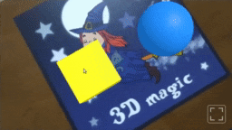

# Add-Ons

Add-Ons provide an enriched experience with additional features that enhance the core of encantar.js. They're offered to supporters who purchase the various demos. Become a supporter and get exclusive access to these features!

<link rel="stylesheet" href="../style/lite-yt-embed.css">

  

## Video Player

Enchant your audience using this [easy-to-use &amp; customizable](./ar-video-player.md) Video Player! Videos in AR are suitable for: product marketing, AR business cards, educational materials, interactive art, and more!

[I want this!](https://ko-fi.com/s/697a184728){ .md-button ._blank }

  

  

    <lite-youtube videoid="sz4Fmf3zyho"></lite-youtube>
  

  

## AR Buttons

Add interactivity to your scenes with easy-to-use buttons for AR! You can [customize their images and colors](./ar-button.md). They're bundled with the Video Player.

[I want this!](https://ko-fi.com/s/697a184728){ .md-button ._blank }

  

  

  

  

## AR Clickables

Turn 3D and 2D objects into "clickables" that respond to touch or mouse input. AR Clickables are based on the [Pointer Tracker](../api/pointer-tracker.md). They are the building blocks of AR Buttons and are included with them.

[I want this!](https://ko-fi.com/s/697a184728){ .md-button ._blank }

  

  

  

  

## Asset Manager

Framework-agnostic solution for preloading assets such as: 3D models, video clips, audio files and more. This Add-On is bundled with the core.

[I want this!](https://ko-fi.com/s/3ee4182cb6){ .md-button ._blank }

  

  

  

