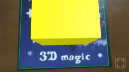

# A-Frame plugin

Documentation of the [A-Frame](https://aframe.io){ ._blank } plugin. Study the [demos](../demos.md) for elaborate examples.

*Since:* 0.3.0

## Basics

### Example

A basic augmented scene can be constructed as follows:

```html
<a-scene encantar="stats: true; gizmos: true">

    <!-- Sources of data -->
    <ar-sources>
        <ar-camera-source></ar-camera-source> <!-- webcam -->
    </ar-sources>

    <!-- Trackers -->
    <ar-trackers>
        <ar-image-tracker>
            <ar-reference-image name="mage" src="mage.png"></ar-reference-image>
        </ar-image-tracker>
    </ar-trackers>

    <!-- AR Viewport -->
    <ar-viewport></ar-viewport>

    <!-- Virtual camera for AR -->
    <ar-camera></ar-camera>

    <!-- Root node: this will be displayed in AR -->
    <ar-root reference-image="mage">
        <a-box color="yellow" position="0 0 0.5"></a-box>
    </ar-root>

</a-scene>
```

{ .responsive }

### encantar

The `encantar` component *enchants* `<a-scene>`, so that it displays content in AR.

**Properties**

* `mode: string`. The [session mode](./session.md#mode). Defaults to `"immersive"`.
* `stats: boolean`. Whether or not to display the built-in stats panel. It's useful during development. Defaults to `false`.
* `gizmos: boolean`. Whether or not to display the [gizmos](./session.md#gizmos). Defaults to `false`.
* `autoplay: boolean`. Whether or not to start the AR [session](./session.md) automatically. Defaults to `true`.

**Example**

```html
<a-scene encantar="stats: true; gizmos: true">
    ...
</a-scene>
```

### ar-root

The `<ar-root>` primitive sets up a node of the virtual scene that is automatically aligned to the physical scene. Simply put, children of this node will augment physical reality. `<ar-root>` must be a direct child of `<a-scene>`. It does not have to be unique. See also: [ar-camera](#ar-camera).

**Properties**

* `reference-image: string`. The name of a [reference image](./reference-image.md) or the empty string. This node will be matched to the specified reference image, or to any reference image if this property is the empty string. Defaults to the empty string. See also: [ar-reference-image](#ar-reference-image).

**Example**

```html
<a-scene encantar>

    ...

    <!-- Matches only the specified reference image -->
    <ar-root reference-image="mage">
        ...
    </ar-root>

    <!-- Matches any reference image -->
    <ar-root>
        ...
    </ar-root>

    ...

</a-scene>
```

## Visualization

### ar-viewport

The `<ar-viewport>` primitive sets up the [viewport](./viewport.md) that will be linked to the AR [session](./session.md). It must be unique and a direct child of `<a-scene>`. See also: [ar-hud](#ar-hud).

**Properties**

* `resolution: string`. The [resolution of the viewport](./viewport.md#resolution), which corresponds to the resolution of the virtual scene. See also: [Resolution](./resolution.md).
* `style: string`. The [style of the viewport](./viewport.md#style).
* `fullscreen-ui: component`. A component that controls the built-in fullscreen button. This button included as a convenience if the fullscreen mode is [available](./viewport.md#fullscreenavailable) on the target platform. The following properties are available:
    * `enabled: boolean`. Whether or not to display the fullscreen button. Defaults to `true`.

**Example**

```html
<a-scene encantar>

    ...

    <ar-viewport resolution="lg">
        ...
    </ar-viewport>

    ...

</a-scene>
```

### ar-hud

The `<ar-hud>` primitive sets up a [Heads Up Display](./hud.md), a 2D overlay that is displayed in front of the augmented scene. It's meant to contain HTML elements. Additionally, it must be a direct child of `<ar-viewport>`. See also: [ar-viewport](#ar-viewport).

**Example**

```html
<ar-viewport>
    <ar-hud>

        <!-- This will be displayed in front of the augmented scene -->
        <button id="example-button">Tap me</button>

    </ar-hud>
</ar-viewport>
```

### ar-camera

`<ar-camera>` sets up a virtual camera that is ready for AR. It should be unique and a direct child of `<a-scene>`. Do not confuse it with `<a-camera>`, the standard camera from A-Frame. See also: [ar-root](#ar-root).

**Example**

```html
<a-scene encantar>

    ...

    <ar-camera></ar-camera>

    ...

</a-scene>
```

## Sources

### ar-sources

The `<ar-sources>` primitive is used to specify the [sources of data](./source.md) that will be linked to the AR [session](./session.md). It must be unique and a direct child of `<a-scene>`.

**Example**

```html
<a-scene encantar>

    ...

    <ar-sources>
        ...
    </ar-sources>

    ...

</a-scene>
```

### ar-camera-source

`<ar-camera-source>` sets up a [CameraSource](./camera-source.md), which is source of data linked to a webcam. It must be a direct child of `<ar-sources>`.

**Properties**

* `resolution: string`. The preferred [resolution of the camera](./camera-source.md#resolution). See also: [Resolution](./resolution.md).
* `facing-mode: string`. The preferred camera on mobile devices. Typically `"environment"` (rear camera) or `"user"` (front camera). Defaults to `"environment"`.

**Example**

```html
<ar-sources>
    <ar-camera-source resolution="md"></ar-camera-source>
</ar-sources>
```

### ar-video-source

`<ar-video-source>` sets up a [VideoSource](./video-source.md), which is a source of data linked to a `<video>` element. It must be a direct child of `<ar-sources>`.

**Properties**

* `video: selector`. A selector of a `<video>` element.

**Example**

```html
<ar-sources>
    <ar-video-source video="#my-video"></ar-video-source>
</ar-sources>

...

<!-- External assets -->
<video id="my-video" hidden muted loop playsinline autoplay>
    <source src="my-video.webm" type="video/webm" />
    <source src="my-video.mp4" type="video/mp4" />
</video>
```

### ar-canvas-source

`<ar-canvas-source>` sets up a [CanvasSource](./canvas-source.md), which is a source of data linked to a `<canvas>` element. It must be a direct child of `<ar-sources>`.

**Properties**

* `canvas: selector`. A selector of a `<canvas>` element.

### ar-pointer-source

`<ar-pointer-source>` sets up a [PointerSource](./pointer-source.md), a source of pointer-based input. It must be a direct child of `<ar-sources>`. See also: [ar-pointer-tracker](#ar-pointer-tracker).

*Since:* 0.4.0

**Example**

```html
<ar-sources>
    ...
    <ar-pointer-source></ar-pointer-source>
</ar-sources>
```

## Trackers

### ar-trackers

The `<ar-trackers>` primitive is used to specify the [trackers](./tracker.md) that will be linked to the AR [session](./session.md). It must be unique and a direct child of `<a-scene>`.

**Example**

```html
<a-scene encantar>

    ...

    <ar-trackers>
        ...
    </ar-trackers>

    ...

</a-scene>
```

### ar-image-tracker

`<ar-image-tracker>` sets up an [ImageTracker](./image-tracker.md), which is used to track images in a video. You must include at least one `<ar-reference-image>` as a direct child. See also: [ar-reference-image](#ar-reference-image), [ar-camera-source](#ar-camera-source), [ar-video-source](#ar-video-source).

**Properties**

* `resolution: string`. The [resolution of the tracker](./image-tracker.md#resolution). See also: [Resolution](./resolution.md).

**Example**

```html
<ar-trackers>
    <ar-image-tracker resolution="md">
        <ar-reference-image name="mage" src="mage.png"></ar-reference-image>
        <ar-reference-image name="magic" src="magic.png"></ar-reference-image>
    </ar-image-tracker>
</ar-trackers>
```

### ar-reference-image

`<ar-reference-image>` defines a [ReferenceImage](./reference-image.md) to be used by an image tracker. It must be a direct child of `<ar-image-tracker>`. See also: [ar-image-tracker](#ar-image-tracker).

**Properties**

* `name: string`. The name of the reference image. You may link it with `<ar-root>`. Names must be unique. See also: [ar-root](#ar-root).
* `src: string`. Path to the image.

**Example**

```html
<ar-image-tracker>
    <ar-reference-image name="mage" src="mage.png"></ar-reference-image>
</ar-image-tracker>
```

### ar-pointer-tracker

`<ar-pointer-tracker>` sets up a [PointerTracker](./pointer-tracker.md), which is used to track pointer-based input. It must be a direct child of `<ar-trackers>`. See also: [ar-pointer-source](#ar-pointer-source), [pointers](#pointers).

*Since:* 0.4.0

**Properties**

* `space: string`. The [space](./pointer-tracker.md#space) in which pointers will be located. *Since:* 0.4.1

**Example**

```html
<ar-trackers>
    ...
    <ar-pointer-tracker></ar-pointer-tracker>
</ar-trackers>
```

## AR System

### ar

The `ar` system conveniently exposes useful objects and methods in JavaScript. It may be accessed from any component by writing `this.el.sceneEl.systems.ar`.

**Example**

```js
AFRAME.registerComponent('my-component', {

    // ...

    tick()
    {
        const scene = this.el.sceneEl;
        const ar = scene.systems.ar;
        const session = ar.session;

        // ...
    },

    // ...

});
```

### session

`ar.session: Session | null`

The AR [Session](./session.md). If the AR session hasn't been started, this will be `null`.

### frame

`ar.frame: Frame | null`

The current [Frame](./frame.md). If the AR scene isn't initialized, this will be `null`.

### viewer

`ar.viewer: Viewer | null`

A reference to the [Viewer](./viewer.md) of the current frame, if any.

*Since:* 0.4.0

### pointers

`ar.pointers: TrackablePointer[]`

The [TrackablePointers](./trackable-pointer.md) of the current frame, if any. Make sure to add a `<ar-pointer-tracker>` in order to use these. See also: [ar-pointer-tracker](#ar-pointer-tracker).

*Since:* 0.4.0

### utils

`ar.utils: object`

[Utilities](#utilities) for AR.

*Since:* 0.4.0

## Utilities

### convertVector2

`ar.utils.convertVector2(v: Vector2): THREE.Vector2`

Convert a [Vector2](./vector2.md) into a `THREE.Vector2`.

*Since:* 0.4.0

**Arguments**

* `v: Vector2`. A 2D vector.

**Returns**

A corresponding `THREE.Vector2`.

### convertVector3

`ar.utils.convertVector3(v: Vector3): THREE.Vector3`

Convert a [Vector3](./vector3.md) into a `THREE.Vector3`.

*Since:* 0.4.0

**Arguments**

* `v: Vector3`. A 3D vector.

**Returns**

A corresponding `THREE.Vector3`.

### convertQuaternion

`ar.utils.convertQuaternion(q: Quaternion): THREE.Quaternion`

Convert a [Quaternion](./quaternion.md) into a `THREE.Quaternion`.

*Since:* 0.4.0

**Arguments**

* `q: Quaternion`. A quaternion.

**Returns**

A corresponding `THREE.Quaternion`.

### convertRay

`ar.utils.convertRay(r: Ray): THREE.Ray`

Convert a [Ray](./ray.md) into a `THREE.Ray`.

*Since:* 0.4.0

**Arguments**

* `r: Ray`. A ray.

**Returns**

A corresponding `THREE.Ray`.

## Events

### arstarted

This event is emitted on the scene when the main loop of the AR scene is set up, just after the AR session starts.

*Since:* 0.4.2. Previously, this event was called *ar-started*.

**Details**

* `ar: object`. A reference to the [ar](#ar) system.

### arfinished

The AR session has ended.

*Since:* 0.4.2

**Details**

* `ar: object`. A reference to the [ar](#ar) system.