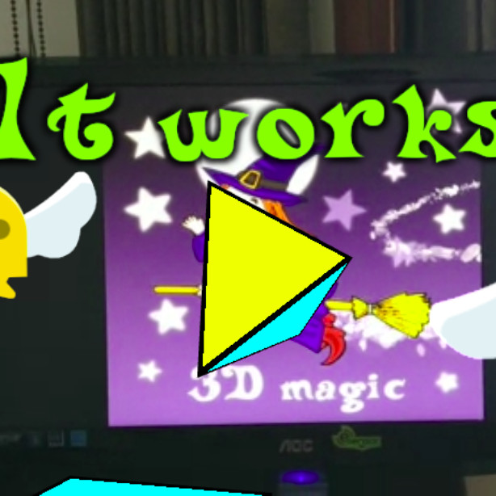
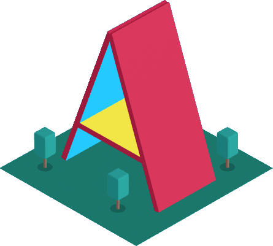

# WebAR demos

Welcome to my demo gallery! Here you'll find some cool examples of what you can do with MARTINS.js. Feel free to adapt my demos and also to study my code.

!!! info "Derivative works"

    The Free Edition of MARTINS.js is included with my demos. Before creating derivative works of my demos, make sure to [pick the right edition for you](./download.md){ ._blank }.

## Free demos

The following free demos will help you get started:

<a href="https://ko-fi.com/s/058542943d" rel="external" target="_blank">

**Hello, world!**

</a>

<a href="https://ko-fi.com/s/25f4038f8b" rel="external" target="_blank">

**Render with WebGL (3D)**

</a>

## Glue codes

MARTINS.js scans the physical environment, but it doesn't render virtual content. Third-party 3D rendering technologies can help you with that. Glue codes link MARTINS.js to different 3D rendering technologies. My glue codes are compatible with both the Free and the Professional Edition of MARTINS.js. A basic demo is included with all of them.

<a href="https://ko-fi.com/s/24523f7548" rel="external" target="_blank">

**AFRAME + MARTINS.js**

</a>

<a href="https://ko-fi.com/s/eea4077938" rel="external" target="_blank">

**THREE.js + MARTINS.js**

</a>

**BABYLON.js + MARTINS.js (soon)**

!!! tip Tip

    AFRAME is the easiest choice for non-coders. If you're a coder, all choices are good.

## Fun & games

WebAR can be a lot of fun. More demos coming soon!

<a href="https://ko-fi.com/s/1d3c7e401c" rel="external" target="_blank">

**Touch interaction with THREE.js**

</a>

## Need something else?

You need a WebAR experience tailored for you, but you are unable to do it yourself. Is that your situation? Feel free to make a request!

[Request a WebAR experience](https://ko-fi.com/alemart/commissions){ ._blank .md-button }