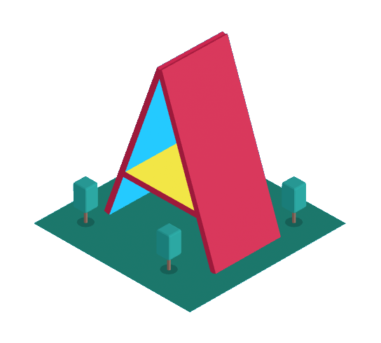

# WebAR demos

Welcome to my demo gallery! Here you'll find some cool examples of what you can do with MARTINS.js. Feel free to adapt my demos and also to study my code. My demos are available for a fee, which helps my work.

The Free Edition of MARTINS.js is included with my demos. The Professional Edition is available [separately](./download.md){ ._blank }. Before creating derivative works of my demos, make sure to [pick the right edition](./download.md){ ._blank } for you. If you have questions, feel free to [reach out](./contact.md){ ._blank }.

## Glue codes

MARTINS.js scans the physical environment, but it doesn't render virtual content. You need a 3D rendering technology for that. Glue codes link MARTINS.js to different 3D rendering technologies. My glue codes are compatible with both the Free and the Professional Edition of MARTINS.js.

AFRAME is the easiest choice for non-coders. If you're a coder, all choices are good. A basic demo is included with all of them.

<a href="https://ko-fi.com/s/24523f7548" rel="external" target="_blank">

**AFRAME + MARTINS.js**

</a>

<a href="https://ko-fi.com/s/eea4077938" rel="external" target="_blank">

**THREE.js + MARTINS.js**

</a>

**BABYLON.js + MARTINS.js (soon)**

## For newbies

These simple demos help you get started with WebAR. They are great learning material!

<a href="https://ko-fi.com/s/058542943d" rel="external" target="_blank">

**Hello world with MARTINS.js**

</a>

<a href="https://ko-fi.com/s/1d3c7e401c" rel="external" target="_blank">

**Touch interaction with THREE.js**

</a>

## Fun & games

Soon!

## Need something else?

You need a WebAR experience tailored for you, but you are unable to do it yourself. Is that your situation? Feel free to make a request!

[Request a WebAR experience](https://ko-fi.com/alemart/commissions){ ._blank .md-button }