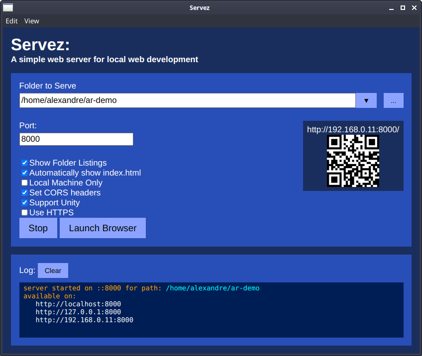
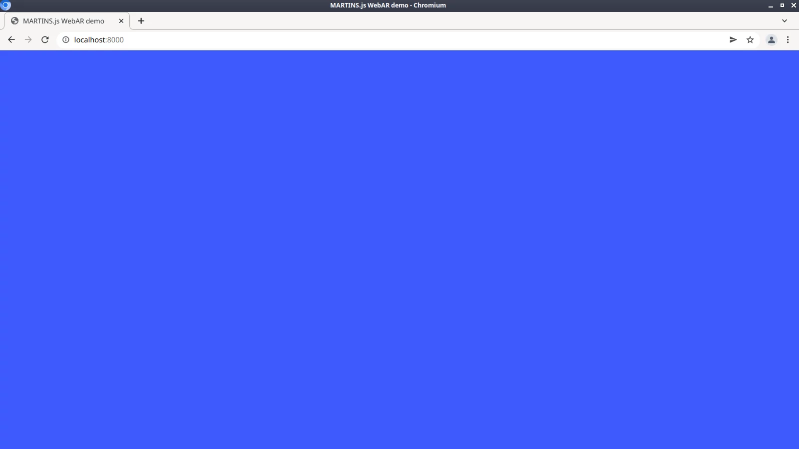

# Set up a web server

Let's prepare our local environment in order to create our first WebAR experience.

## Create a file structure

Let's create a file structure for our AR experience:

1. Create a new folder called `ar-demo` in your filesystem
2. Download the [latest release of MARTINS.js](../download.md){ ._blank } and extract `dist/martins.js` to `ar-demo/`
3. Create a new empty file called `index.html` and store it in `ar-demo/`

You will have the following file structure:

    ar-demo/
    ├── index.html
    └── martins.js

## Add boilerplate code

Use the code editor of your choice to write the following content to `index.html`:

```html title="index.html"
<!doctype html>
<html>
    <head>
        <meta charset="utf-8">
        <meta name="viewport" content="width=device-width,initial-scale=1">
        <title>MARTINS.js WebAR demo</title>
        <script src="martins.js"></script>
        <style>body { background-color: #3d5afe; }</style>
    </head>
    <body>
    </body>
</html>
```

## Set up a local web server

Let's set up a local web server in your machine for development purposes. I'll be showing you an easy-to-follow approach. Feel free to use a different approach if you're an experienced web developer.

=== "Graphical interface"

    This is an easy solution that works on Windows, Linux and macOS:

    1. [Download and run Servez](https://greggman.github.io/servez/){ ._blank }, a simple web server for local web development.
    2. In _Folder to Serve_, specify the `ar-demo` folder we have just created.
    3. Change the _Port_ to **8000**.
    4. Click on _Start_ to launch the local web server.
    5. Click on _Launch Browser_ to open a web browser at <http://localhost:8000>{ ._blank }.

    <figure markdown>
    { width=600 }
    <figcaption>Setting up Servez: make sure that _Folder to Serve_ points to the correct path in your filesystem!</figcaption>
    </figure>

=== "Command line"

    If you're familiar with the command line, you can use programs such as `python`, `node` or `php` to launch a local web server. Navigate to the `ar-demo` directory and then run:

    === "Python 2"

        ```sh
        python -m SimpleHTTPServer 8000
        ```

    === "Python 3"

        ```sh
        python3 -m http.server 8000
        ```

    === "Node.js"

        ```sh
        npx http-server -p 8000
        ```

    === "PHP"

        ```sh
        php -S localhost:8000
        ```

    Next, open your web browser and go to <http://localhost:8000>{ ._blank }.


You should see a blue screen in your web browser:

<figure markdown>
[](../img/page-with-nothing.webp){ ._blank }
<figcaption>Blue Screen of Success</figcaption>
</figure>

If you see that blue screen, you're ready to proceed. If not, review your settings.

!!! info "Why port 8000?"

    Port 8000 is commonly used in web development. Although you may use a different port, I suggest that you stick to this convention throughout this guide.